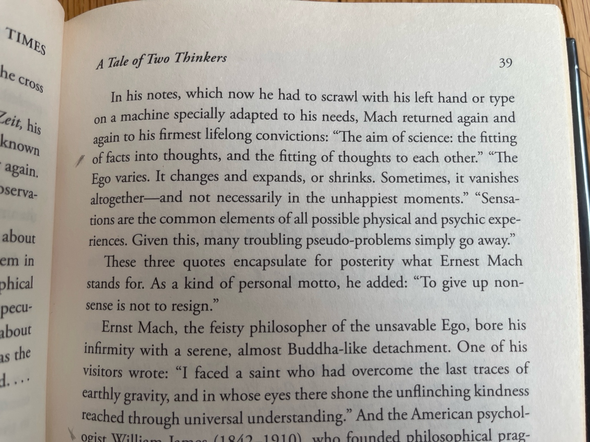

The form of this README is shamelessly poached from Zhengdong Wang. He starts [his README](https://zhengdongwang.com/readme) with the following:

> *Instead of attempting the daunting task of writing about myself (I am perennially unhappy with the results), here is a collection of things I want to associate myself with. They are things I like, things I think about, things that have influenced me. You can interpolate the rest.*

I'll add that writing about yourself also fossilizes one possible story. A person is too complex to fit in even their own mind, so while you must distill that into a story to make yourself legible to others, an expansive life requires that you retain internal narrative dynamism. There are many stories implicit in this list, but let us live out a better one. 

**The Collective**
- *Varieties of Capitalism*. I really enjoyed its version of a "grand theory" and tolerance of complexity and interconnection. 
- *Poor Economics*. At a totally different layer of abstraction (at the "atomic" of a social science), sometimes it is nice to know that something is Most Likely True, and you can make sure and steady progress towards big problems. Big ideas are not for solving problems. Big ideas are for inspiration. 
- *Faith in Moderation* from Jillian Schwedler. I don't remember most of the claims, but I remember it as the first book I read that moved between the big and the small and was satisfying granular/precise in its analyses. I was almost sure I wanted to do a PhD after this, but alas it was not meant to be. 
- *The Prize*. Technically a history of oil! But really it's a wonderful depiction of "economics" and "politics" as they exist at the "more real" level of individual interactions and choices. 
- *More Money Than God* is also great fun. 

**Progress**
- Samantha Power's *Chasing the Flame*. Sérgio Vieira de Mello was a Brazilian/UN diplomat with a long (but not long enough) career contending with evil and suffering in basically every failed state and warzone in the late 20th century. He was the first official to speak to Khmer Rouge; in the Balkans talking to the Serbs, the Albanians, and the Americans; he was in Sergio post-genocide figuring out how to be humanitarian without fueling war; he was in East Timor setting up the pseudo-interim-government...(Apparently someone joked that his autobiography ought to be titled “My Friends, the War Criminals.”) Despite the standard impossibilities of international politics and violent local grievances, it has filled me with hope that a single competent person can do so much, and that there are people who found a way to hold both idealism and pragmatism in one life. He died in the suicide bombing of Canal Hotel in Baghdad, on August 19, 2003. 
- Vannevar Bush's *Pieces of the Action* 
- Jobs
- Michael Nielsen's [Augmenting Long-term Memory](https://augmentingcognition.com/ltm.html). Spaced repetition flash cards might not seem so related to "progress," but as [gwern](https://gwern.net/spaced-repetition#where-was-i-going-with-this) says, "It’s a testament to the Enlightenment ideal of improving humanity through reason and overcoming our human flaws...it’s really nice to just have a small example like this in one’s daily life, an example not yet so prosaic and boring as the lightbulb." 

**Technology** 

Really this should be bundled in "progress," since progress is the result of a supportive context (hence politics, economics) for great science and its applications, but we'll leave it separated. Despite America's loss of manufacturing communities and the resulting "process knowledge," the online community for non-physical technology is really great. I have really enjoyed reading from [Simon Willison](https://simonwillison.net/), [Michael Nielsen](https://michaelnielsen.org/), and [Paul Graham](https://paulgraham.com/worked.html).

**Beingness**

- Bhagavad Gita. Easwaran's introduction is quite clear as well. I also found Siddhartha (from Herman Hesse) and the Dhammapada (also Easwaran) thought-enriching in complementary ways. 
  
 
    Right understanding is seeing life as it is. In the midst of change, where is there a place to stand firm? Where is there anything to have and hold? To know that happiness cannot come from anything outside, and that all things that come into being have to pass away: this is right understanding, the beginning of wisdom.
  

- Marilynne Robinson's *Gilead*
- Wittgenstein's *Tractatus* 
  

  
There is no such thing as excerpting propositions, but here are some: 

  
  > *5.6 The limits of my language mean the limits of my world.*
  

  > *6.5 When an answer cannot be stated, neither can the question be stated.*
  >> *There is no such thing as the riddle.*
  >> *If a question can be posed at all, then it can also be answered.*

  > *6.521 The solution to the problem of life is found in the vanishing of the problem.*
  >> *(Is this not the reason why those to whom the meaning of life became clear after prolonged doubt, could not then say in what this meaning consisted?)*

  > *6.522 There is, though, the ineffable.*
  >> *This shows itself, it is the mystical.*
  

- [Rob Burbea](https://www.youtube.com/watch?v=n03ZNoO-_p0&list=PLO6hhaAzLmipGYeeZCr-Cn_YuJj_XgUat&ab_channel=RobBurbeaTalks)
- Nick Cammarata. [tanha 1](https://x.com/nickcammarata/status/1566589893136064512) [tanha 2](https://x.com/nickcammarata/status/1649952823843463168)
- 

**Math** 

We can all be transformed with the really unmatchable sensation of "understanding truth" and seeing the world in a new way. 
- *A Mathematician's Lament* from Paul Lockhart on the terrible way math is usually taught. What might it mean to actually understand something? 
- Andrew Neitzke's class notes for Real Analysis. 
- [3b1b](https://www.youtube.com/c/3blue1brown), how can it be otherwise. 
- There are various Quanta Magazine pieces that illustrate what math can be. [insert some favorites]

**Literature**
- Gabriel García Márquez' *A Hundred Years of Solitude*. After this, I was so astonished that I also went on to *Pedro Páramo* from Juan Rulfo, for which Gabo said, "That night I couldn't sleep until I had read it twice...I could recite the entire book front to back and vice versa without a single appreciable error, I could tell you on which page of my edition each scene could be found." Perhaps I am too generationally and culturally removed: *A Hundred Years of Solitude* is indisputably more wonderful to me.  
  

  
An excerpt of *A Hundred Years of Solitude*

  
  Before them, surrounded by ferns and palm trees, white and powdery in the silent morning light, was an enormous Spanish galleon. Tilted slightly to the starboard, it had hanging from its intact masts the dirty rags of its sails in the midst of its rigging, which was adorned with orchids. The hull, covered with an armor of petrified barnacles and soft moss, was firmly fastened into a surface of stones. The whole structure seemed to occupy its own space, one of solitude and oblivion, protected from the vices of time and the habits of the birds. Inside, where the expeditionaries explored with careful intent, there was nothing but a thick forest of flowers.
  

- David Foster Wallace's *Infinite Jest*, *This Is Water* (video [here](https://www.youtube.com/watch?v=5tIk4IOOeco)), and "Roger Federer as a Religious Experience".
- Vladimir Nabokov's *Speak, Memory* and *Lolita*. 
- Anthony Bourdain's *Kitchen Confidential*. 
- Iris Murdoch's *The Sea, The Sea*. 
- Bulgakov's *The Master and Margarita*. 
- Frank O’Hara's *Mayakovsky*. 
- OSC's *Xenocide*. This is an old one, but I remember reading it three times. 
- Asimov's *Prelude to Foundation*. I also remember this as a 3x-er, but I haven't tried since middle school so don't know how it aged. 
- Dunlop's *Invitation to a Banquet*. Very fun. Since the author isn't burdened by being born into Chineseness, she can tell me all about the weird things about Chinese food that I otherwise would not have noticed! A fish does not know how the water is, after all. 

**Music**
- Radiohead's album *In Rainbows*. Notably, "Weird Fishes/Arpeggi".
- Chick Corea's *Spain*. The life! The fun!

**Painting**
- Rothko. It is a great gift to see one in person and an even greater joy to see 115 of them in Paris (thanks Arnault!). 
- Monet. Obviously, but the colors are delicate, precise, take you somewhere that doesn't exist but is also everywhere in nature. 
- Kandinsky
- Picasso's *Repose*. She's perfect!
- Anna Laura 
- Joan Miró

